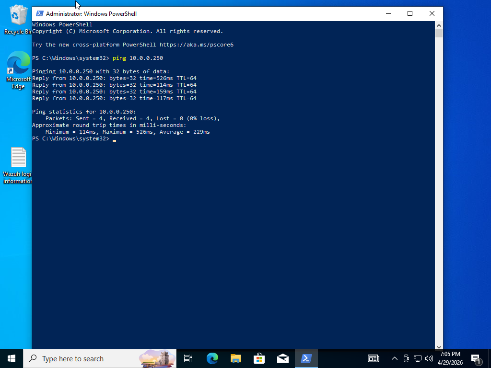
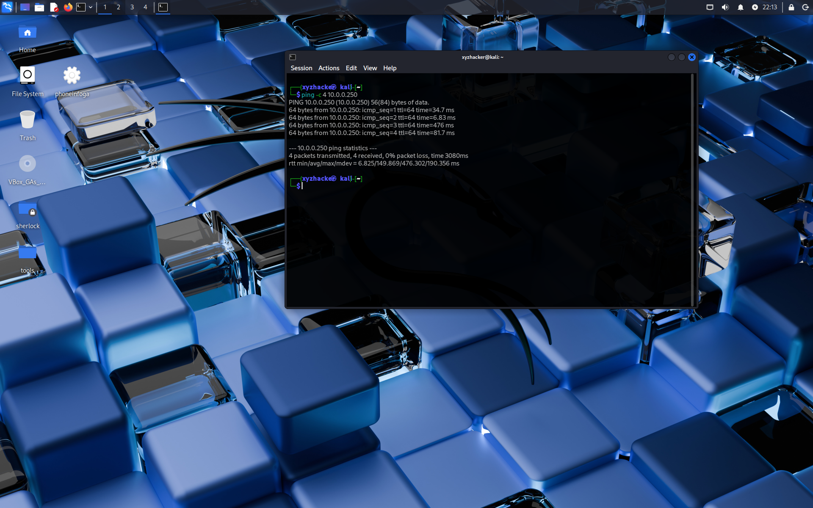
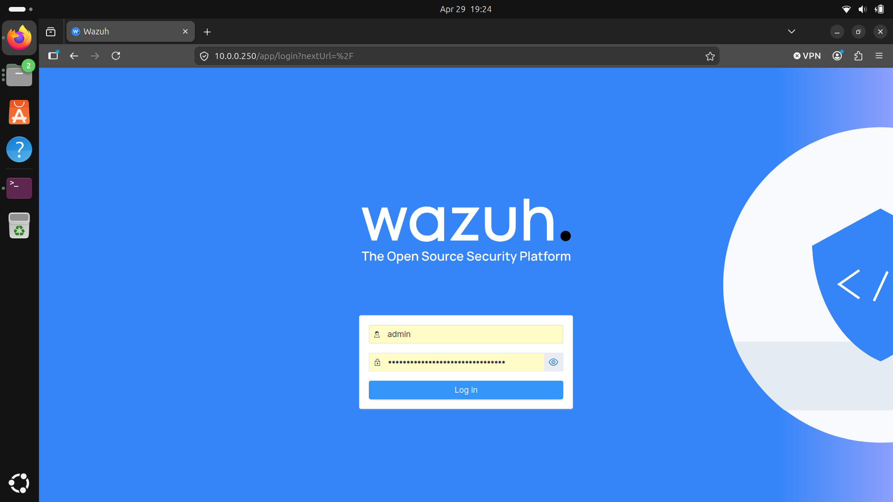
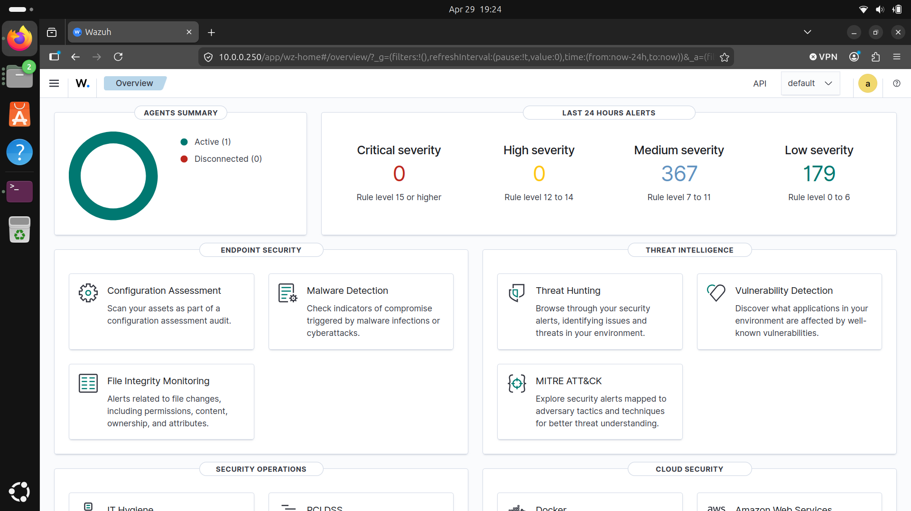
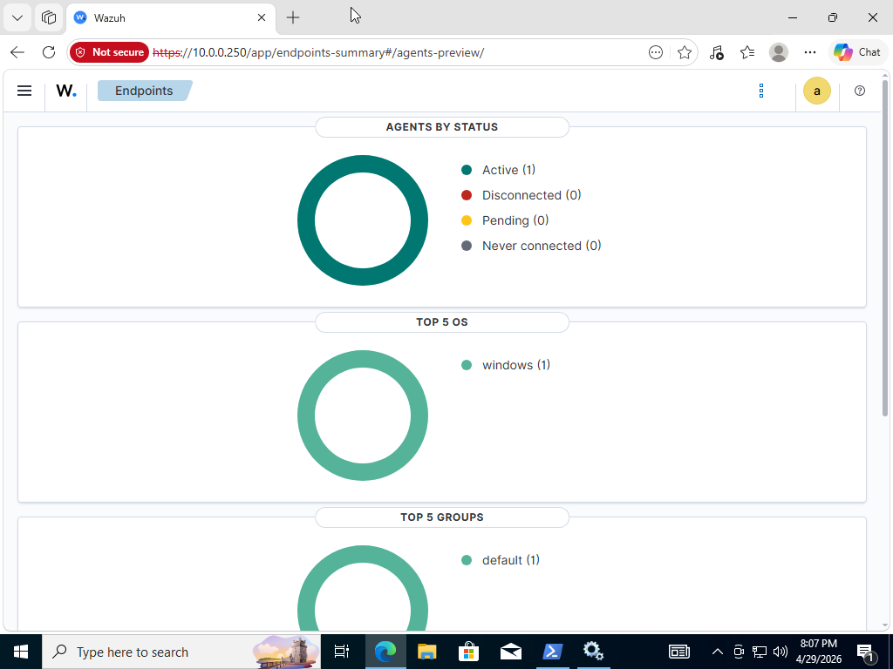
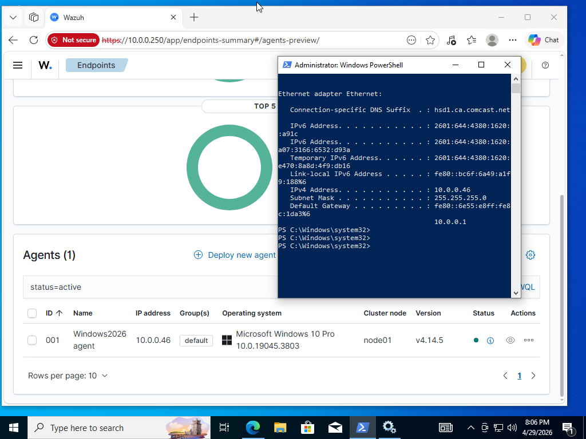

# Wazuh SOC Lab

## Lab Objective

The goal of this lab is to build a small SOC environment using Wazuh as the SIEM. The lab collects logs from Windows and Ubuntu endpoints, generates safe simulated security events, investigates alerts, documents IOCs, and maps findings to MITRE ATT&CK techniques.

## Lab Architecture

This lab uses a physical Ubuntu laptop as the Wazuh server and a separate PC running VirtualBox for the endpoint and attacker virtual machines.

| System | Role | Platform | Notes |
|---|---|---|---|
| Ubuntu Laptop | Wazuh Server | Physical laptop | Runs Wazuh manager, dashboard, and indexer |
| Windows 10 VM | Monitored Endpoint | VirtualBox on PC | Wazuh agent installed |
| Kali Linux VM | Test Attacker Machine | VirtualBox on PC | Used only for safe simulations |

## Network Configuration

All systems are connected on the same local network. The Ubuntu laptop hosts the Wazuh server, while the Windows 10 and Kali Linux VMs run on a separate PC using VirtualBox.

| System | Example IP Address | Connectivity Status |
|---|---|---|
| Wazuh Server | 10.0.0.X | Reachable |
| Windows 10 VM | 10.0.0.X | Can reach Wazuh server |
| Kali Linux VM | 10.0.0.X | Can reach lab systems |

## Connectivity Validation

Connectivity was tested from the lab systems to confirm that the Wazuh server and virtual machines could communicate over the local network.

| Test | Result |
|---|---|
| Windows 10 VM ping to Wazuh server | Successful |
| Kali VM ping to Wazuh server | Successful |
| Wazuh dashboard reachable from PC browser | Successful |

## Step 1 Findings: Lab Setup and Connectivity

The lab network was successfully configured. The Wazuh server is running on a physical Ubuntu laptop, while the Windows 10 and Kali Linux VMs are hosted on a separate PC using VirtualBox. All systems are able to communicate over the local network.

The Windows 10 VM is used as a monitored endpoint with the Wazuh agent installed. The Kali Linux VM is used only to generate safe test activity against lab-owned systems. The Wazuh dashboard is reachable from the PC browser, confirming that the SIEM server is accessible across the lab network.

### Windows 10 VM Ping to Wazuh Server

Evidence:

### Kali VM Ping to Wazuh Server

Evidence:

### Wazuh Login and Dashboard Access

The Wazuh login page and dashboard were successfully accessed from the PC browser using the Ubuntu laptop’s local network IP address.

Evidence:

## Step 2: Windows 10 Wazuh Agent Deployment

The Wazuh agent was installed on the Windows 10 virtual machine and configured to communicate with the Wazuh server running on the Ubuntu laptop.

### Windows Endpoint Details

| Field | Value |
|---|---|
| Endpoint | Windows 10 VM |
| Role | Monitored endpoint |
| Wazuh agent status | Active |
| Wazuh server | Ubuntu laptop |
| Network connection | Local network |

### Evidence

| Evidence | Screenshot |
|---|---|
| Windows agent active in Wazuh |  |
| Windows agent details page |  |
| Windows events visible in Wazuh |  |

### Step 2 Findings

The Windows 10 virtual machine was successfully onboarded into Wazuh as a monitored endpoint. The agent appeared as active in the Wazuh dashboard, confirming communication between the Windows VM and the Wazuh server. Windows event data was visible in the Threat Hunting section, confirming that the endpoint was sending telemetry to the SIEM.
